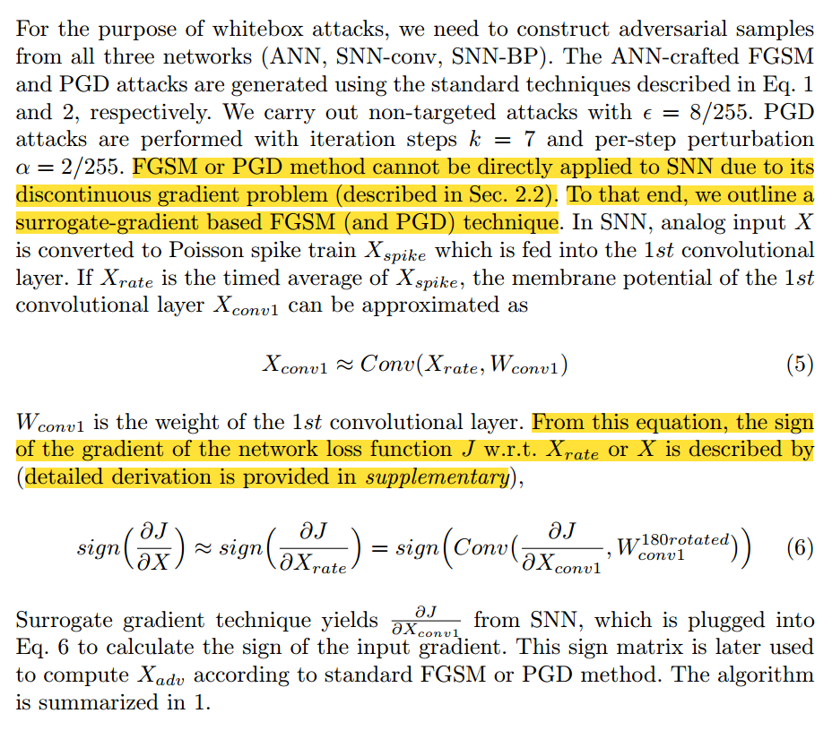
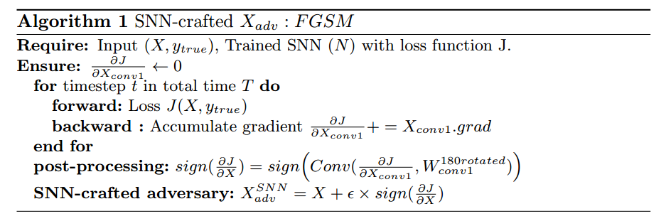
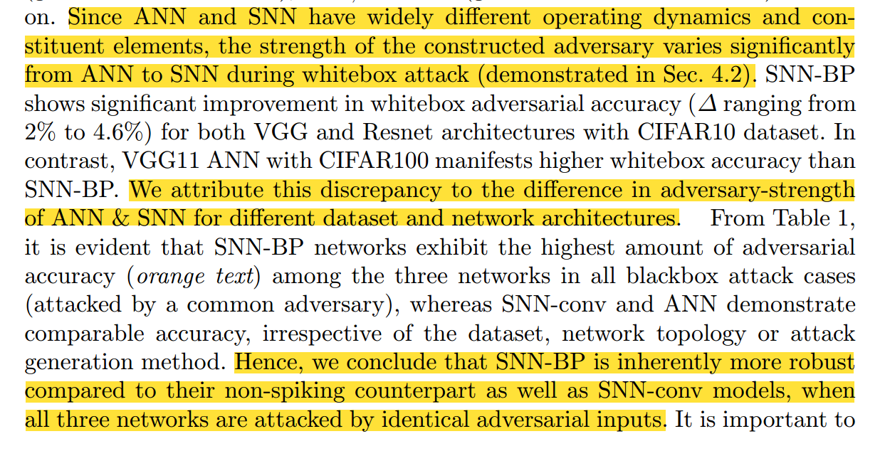
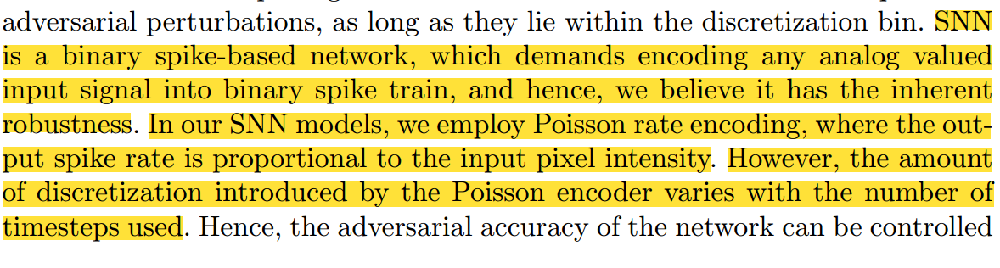

摘要：1 https://github.com/ssharmin/spikingNN-adversarial-attack

In the recent quest for trustworthy neural networks, we present Spiking Neural Network (SNN) as a potential candidate for inherent robustness against adversarial attacks. In this work, we demonstrate that adversarial accuracy of SNNs under gradient-based attacks is higher than their non-spiking counterparts for CIFAR datasets on deep VGG and ResNet architectures, particularly in blackbox attack scenario. We attribute this robustness to two fundamental characteristics of SNNs and analyze their effects. First, we exhibit that input discretization introduced by the Poisson encoder improves adversarial robustness with reduced number of timesteps. Second, we quantify the amount of adversarial accuracy with increased leak rate in Leaky-Integrate-Fire (LIF) neurons. Our results suggest that SNNs trained with LIF neurons and smaller number of timesteps are more robust than the ones with IF (Integrate-Fire) neurons and larger number of timesteps. Also we overcome the bottleneck of creating gradient-based adversarial inputs in temporal domain by proposing a technique for crafting attacks from SNN1

在最近对可信神经网络的探索中，我们提出了峰值神经网络(SNN)作为对抗对抗性攻击的固有鲁棒性的潜在候选。在这项工作中，我们证明了snn在基于梯度的攻击下的对抗精度高于深度VGG和ResNet架构上的CIFAR数据集的非尖峰对抗性，特别是在黑箱攻击场景中。==我们将这种鲁棒性归因于snn的两个基本特征，并分析了它们的影响。首先，我们展示了由泊松编码器引入的输入离散化通过减少时间步数来提高对抗鲁棒性。其次，我们量化了泄漏-集成-火(LIF)神经元中随着泄漏率的增加而增加的对抗准确率。结果表明，使用LIF神经元和较小的时间步长训练的snn比使用IF (Integrate-Fire)神经元和较大的时间步长训练的snn具有更强的鲁棒性。此外，我们通过提出一种从SNN1制造攻击的技术，克服了在时域创建基于梯度的对抗性输入的瓶颈==

### 1 Introduction

Among the handful of works done in the field of SNN adversarial attacks [19], [2], most of them are restricted to either simple datasets (MNIST) or shallow networks. However, this work extends to complex datasets (CIFAR) as well as deep SNNs which can achieve comparable accuracy to the state-of-the-art ANNs [24], [23]. For robustness comparison with non-spiking networks, we analyze two different types of spiking networks: (1) converted SNN (trained by ANN-SNN conversion [24]) and (2) backpropagated SNN (an ANN-SNN converted network, further incrementally trained by surrogate gradient backpropagation [23]). We identify that converted SNNs fail to demonstrate more robustness than ANNs.

Although authors in [25] show similar analysis, we explain with experiments the reason behind this discrepancy and, thereby, establish the necessary criteria for an SNN to become adversarially robust. Moreover, we propose an SNN-crafted attack generation technique with the help of the surrogate gradient method. We summarize our contribution as follows:

在SNN对抗性攻击领域所做的为数不多的工作[19]，[2]中，大多数都局限于简单数据集(MNIST)或浅层网络。然而，这项工作扩展到复杂数据集(CIFAR)以及可以达到与最先进的人工神经网络[24]，[23]相当精度的深度snn。为了与非尖峰网络进行鲁棒性比较，==我们分析了两种不同类型的尖峰网络:(1)转换SNN(由ANN-SNN转换[24]训练)和(2)反向传播SNN (ANN-SNN转换网络，进一步由代理梯度反向传播[23]增量训练)。我们发现转换后的snn不能表现出比ann更强的鲁棒性。==

==尽管b[25]的作者给出了类似的分析，但我们通过实验解释了这种差异背后的原因，从而建立了SNN具有对抗鲁棒性的必要标准。此外，我们提出了一种基于代理梯度方法的snn攻击生成技术。==我们的贡献总结如下:

contribute：

我们证明，在基于梯度的黑盒攻击场景下，SNN 的对抗精度高于 ANN 在基于梯度的黑盒子攻击场景下，各自的清洁 精度相当。攻击的对象是 在 CIFAR10 和 CIFAR100 数据集上训练的深度 VGG 和 ResNet 架构上进行。数据集训练的深度 VGG 和 ResNet 架构上进行。对于白盒攻击，比较取决于对手的相对 对手的相对优势。

SNN 的鲁棒性增强归因于两个基本特征：通过泊松编码实现输入离散化，以及 LIF（或 IF）神经元的非线性激活。
我们研究了在不同的输入预量化水平下，对抗精度如何随 SNN 中使用的时间步数（推理延迟）而变化。对于反向传播 SNN（使用较少的时间步数进行训练），随着时间步数的减少，离散化程度和对抗鲁棒性也会增加。模拟输入的预量化会带来进一步的改善。不过，转换后的 SNN 似乎只取决于输入的预量化，而不受时间步数变化的影响。由于这些转换后的 SNN 在更多的时间步数下运行 由于这些转换后的 SNN 在更大的时间步数下运行，输入平均化使离散化效应最小化，因此
观察到的不变性。 我们表明，智能网络中的片断线性激活（ReLU）会将对抗性扰动线性地传播到整个网络，而 LIF（或 IF）神经元则会将对抗性扰动线性地传播到整个网络。而 LIF（或 IF）神经元会减弱每一层的扰动效应。此外，LIF 神经元中的泄漏因子为控制对抗性扰动提供了一个额外的旋钮。我们通过定量分析 泄漏对 SNN 的对抗鲁棒性的影响。

总之，我们发现，采用 LIF 神经元的 SNNs，通过基于梯度的代用反向传播进行训练，并以较少的时间步数运行。梯度反向传播训练的 SNN，在较少的时间步数下运行比使用 ANN-SNN 转换训练的 SNN 更稳健。IF 神经元和更多的时间步数。因此，训练技术在满足对抗鲁棒性 SNN 的先决条件方面起着至关重要的作用。

由于 LIF（或 IF）神经元的梯度不连续，SNN 中基于梯度的攻击生成并非易事。我们提出了一种方法 我们提出了一种基于近似代梯度生成攻击的方法。

### 2 Background

In the input layer, a Poisson event generation process is used to convert the continuous valued analog signals into binary spike train

在输入层，用泊松事件生成过程将连续值模拟信号转换成二进制尖峰串

==学习泊松脉冲发生器：==

### 3 Experiments

#### 3.3 Adversarial Input Generation Methodology

### 4 Results

#### 4.1 ANN vs SNN

##### Effect of input quantization and number of timesteps

