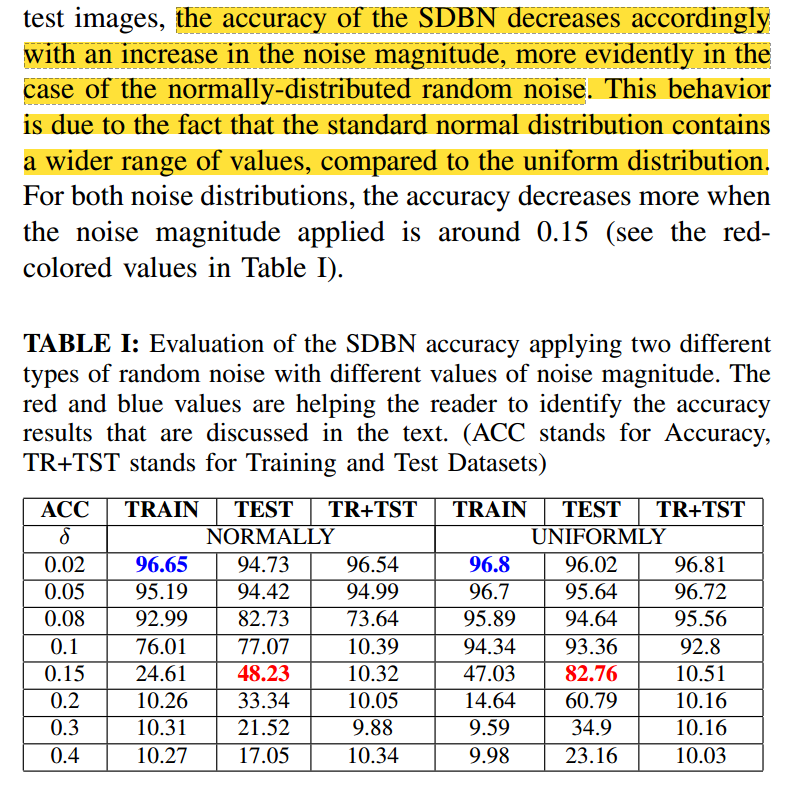
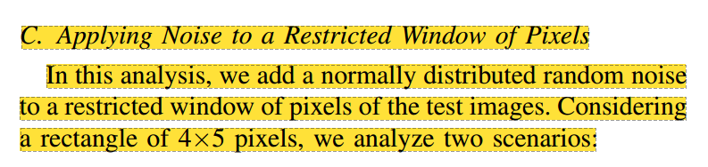
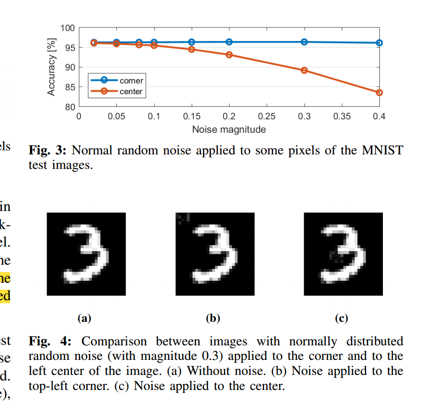
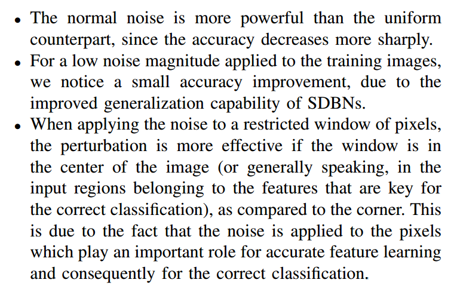
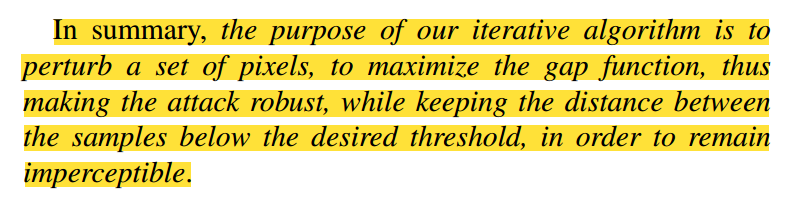
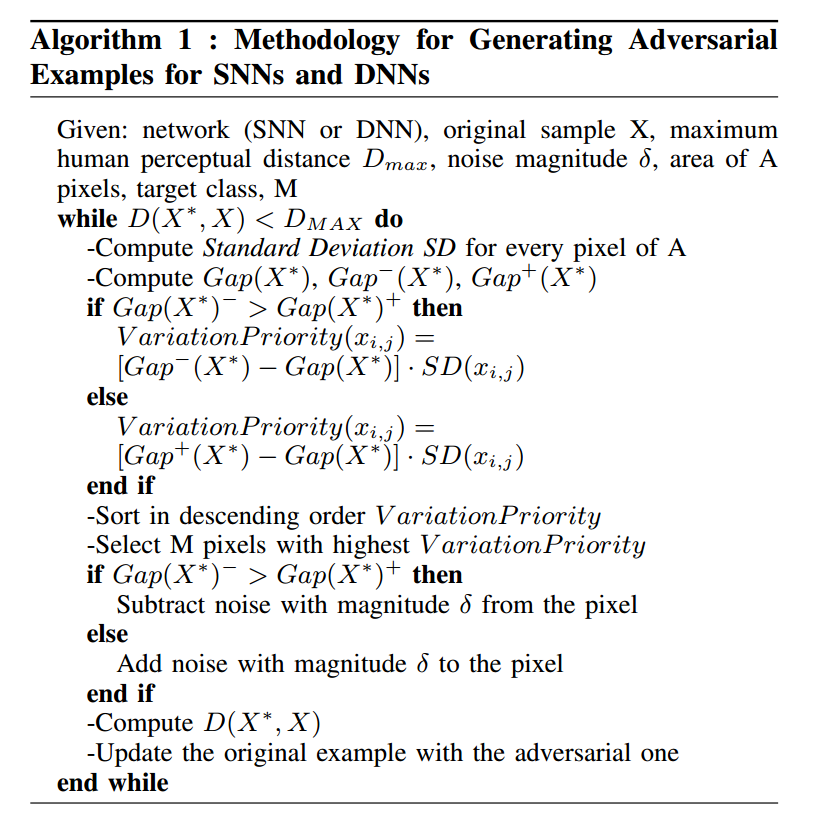
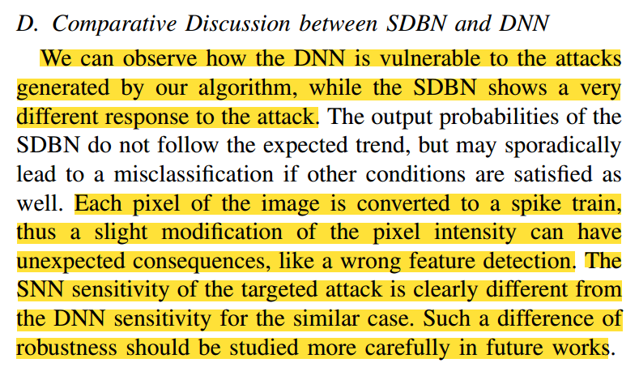

##### 			Is Spiking Secure? A Comparative Study on the Security Vulnerabilities of Spiking and Deep Neural Networks

#### 摘要：

Abstract—Spiking Neural Networks (SNNs) claim to present many advantages in terms of biological plausibility and energy efficiency compared to standard Deep Neural Networks (DNNs).

Recent works have shown that DNNs are vulnerable to adversarial attacks, i.e., small perturbations added to the input data can lead to targeted or random misclassifications. In this paper, we aim at investigating the key research question: “Are SNNs secure?” Towards this, we perform a comparative study of the security vulnerabilities in SNNs and DNNs w.r.t. the adversarial noise. Afterwards, we propose a novel black-box attack methodology, i.e., without the knowledge of the internal structure of the SNN, which employs a greedy heuristic to automatically generate imperceptible and robust adversarial examples (i.e., attack images) for the given SNN. We perform an in-depth evaluation for a Spiking Deep Belief Network (SDBN) and a DNN having the same number of layers and neurons (to obtain a fair comparison), in order to study the efficiency of our methodology and to understand the differences between SNNs and DNNs w.r.t. the adversarial examples. Our work opens new avenues of research towards the robustness of the SNNs, considering their similarities to the human brain’s functionality.

与标准深度神经网络(dnn)相比，峰值神经网络(snn)声称在生物合理性和能量效率方面具有许多优势。

最近的研究表明，dnn容易受到对抗性攻击，即输入数据中添加的小扰动可能导致目标或随机错误分类。在本文中，我们旨在探讨一个关键的研究问题:“snn安全吗?”为此，我们对snn和dnn在对抗噪声下的安全漏洞进行了比较研究。随后，我们提出了一种新的黑盒攻击方法，即在不知道SNN内部结构的情况下，采用贪婪启发式算法对给定SNN自动生成难以察觉的鲁棒对抗示例(即攻击图像)。我们对具有相同层数和神经元的峰值深度信念网络(SDBN)和深度神经网络(DNN)进行了深入评估(以获得公平的比较)，以研究我们的方法的效率，并了解snn和DNN之间的差异。考虑到snn与人类大脑功能的相似性，我们的工作为snn的鲁棒性研究开辟了新的途径。

### I. INTRODUCTION

Our Approach towards Adversarial Attacks on SNNs: In this paper, we aim at generating, for the first time, imperceptible and robust adversarial examples for SNNs under the black-box settings. Bagheri et al [1] studied the vulnerabilities of SNNs under white-box assumptions, while we consider a black-box scenario, which makes the attacker stronger under a wide range of real-world scenarios. For the evaluation, we apply these attacks to a Spiking Deep Belief Network (SDBN) and a DNN having the same number of layers and neurons, to obtain a fair comparison. As per our knowledge1 , this kind of black-box attack was previously applied only to a DNN model [14]. This method is efficient for DNNs because it is able to generate adversarial noise which is imperceptible to the human eye.

我们对snn的对抗性攻击的方法:在本文中，我们的目标是首次为黑盒设置下的snn生成不可察觉和鲁棒的对抗性示例。Bagheri等[1]在白盒假设下研究了snn的漏洞，而==我们考虑的是黑盒场景，这使得攻击者在广泛的现实场景下更强大==。为了评估，我们将这些攻击应用于具有相同层数和神经元数的spike Deep Belief Network (SDBN)和DNN，以获得公平的比较。据我们所知，这种黑盒攻击以前只应用于DNN模型[14]。这种方法对于深度神经网络是有效的，因为它能够产生人眼无法察觉的对抗性噪声。

In short, we make the following Novel Contributions:
1) We analyze the variation in the accuracy of a Spiking Deep Belief Network (SDBN) when a random noise is added to the input images. (Section III)
2) We evaluate the improved generalization capabilities of the SDBN when adding a random noise to the training images. (Section III-C)
3) We develop a methodology to automatically create imperceptible adversarial examples for SNNs. (Section IV)
4) We apply our methodology to an SDBN (it is the first attack of this type applied to SDBNs) and a DNN for generating adversarial examples, and evaluate their imperceptibility and robustness. (Section V)

==简而言之，我们做出了以下新贡献：==

1) 我们分析了在输入图像中添加随机噪声时，尖峰深度信念网络（SDBN）准确性的变化。(第三部分）
2) 我们评估了当在训练图像中添加随机噪声时，SDBN 的泛化能力是否有所提高。(第 III-C 节）
3) 我们开发了一种方法，可自动为 SNN 创建不可感知的对抗示例。(第四部分）
4) 我们将我们的方法应用于 SDBN（这是首次应用于 SDBN 的此类攻击）和 DNN，以生成对抗示例，并评估它们的 不可察觉性和鲁棒性。(第五部分）

### II. BACKGROUND AND RELATED WORK

Motivated by the above-discussed considerations, we propose an algorithm to automatically generate imperceptible and robust adversarial examples for SNNs, and study their differences w.r.t. the adversarial examples generated for DNNs using the same technique.

基于上述考虑，我们==提出了一种自动生成snn的不可感知和鲁棒对抗示例的算法，并研究了它们与使用相同技术为dnn生成的对抗示例的差异。==

### III. ANALYSIS: APPLYING RANDOM NOISE TO SDBNS

we derive the following key observations that can be exploited by an adversarial example generation methodology.

==我们得出了以下关键观察结果，可以通过对抗性示例生成方法加以利用。==

• The normal noise is more powerful than the uniform counterpart, since the accuracy decreases more sharply.

• For a low noise magnitude applied to the training images, we notice a small accuracy improvement, due to the improved generalization capability of SDBNs.

• When applying the noise to a restricted window of pixels, the perturbation is more effective if the window is in the center of the image (or generally speaking, in the input regions belonging to the features that are key for the correct classification), as compared to the corner. This is due to the fact that the noise is applied to the pixels which play an important role for accurate feature learning and consequently for the correct classification.

•正常噪声比均匀噪声更强大，因为精度下降得更快。

•对于应用于训练图像的低噪声量级，我们注意到由于sdbn的泛化能力提高，精度有了小的提高。

•当将噪声应用于受限的像素窗口时，如果窗口位于图像的中心(或者一般来说，在属于正确分类关键特征的输入区域)，与角相比，扰动更有效。这是因为噪声被应用到像素上，这对于准确的特征学习和正确的分类起着重要的作用。

### IV. OUR NOVEL METHODOLOGY TO GENERATE IMPERCEPTIBLE AND ROBUST ADVERSARIAL EXAMPLES

A. Imperceptibility of Adversarial Examples

B. Robustness of adversarial examples

C. How to Automatically Generate Attacks for SNNs?

****

### V. EVALUATING OUR ATTACK METHODOLOGY ON SDBNS AND DNNS

###

The SNN sensitivity of the targeted attack is clearly different from the DNN sensitivity for the similar case. Such a difference of robustness should be studied more carefully in future works

针对性攻击的SNN敏感性与类似情况下的DNN敏感性明显不同。这种鲁棒性的差异应该在以后的工作中进行更仔细的研究

### VI. CONCLUSIONS

In this work, we studied the security vulnerabilities of SNNs, and compared them to DNNs under our attack methodology. However, there is still a long road for research to follow for analyzing and building robust/secure SNNs.

Towards the conclusion of this work, we raise several new research questions like: “What is hidden inside the SNNs that makes them more robust to targeted attacks, as compared to DNNs?” “Can certain specific properties of human brain’s functionality be leveraged to build robust and self-healing machine learning algorithms?” An extensive in-depth study of SNNs w.r.t. different security threats is crucial before adopting SNNs in safety-critical applications.

在这项工作中，我们研究了snn的安全漏洞，并在我们的攻击方法下将它们与dnn进行了比较。然而，要分析和构建健壮/安全的snn，还有很长的路要走。

在这项工作的结论中，我们提出了几个新的研究问题，比如:“与dnn相比，==snn内部隐藏着什么，使它们对目标攻击更强大?==”“==人类大====脑功能的某些特定属性能否被用来构建强大的、自我修复的机器学习算法==?”在安全关键型应用中采用snn之前，对snn进行广泛深入的研究以应对不同的安全威胁是至关重要的。