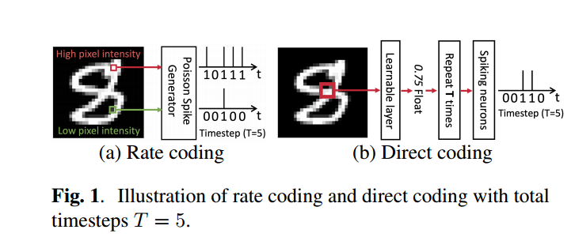
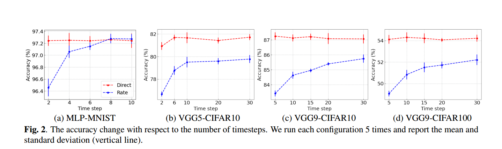
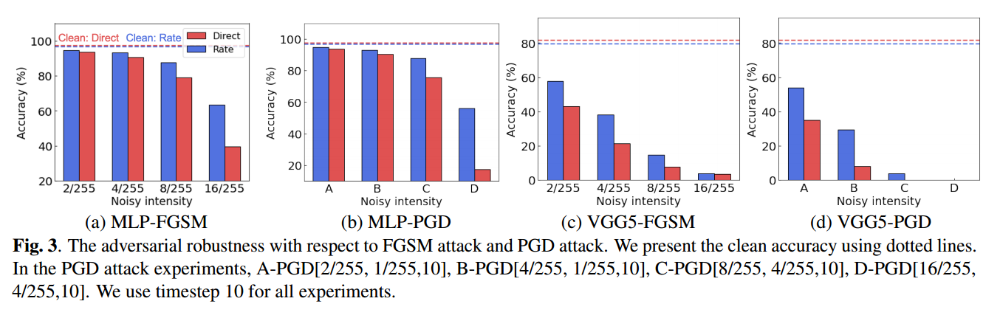
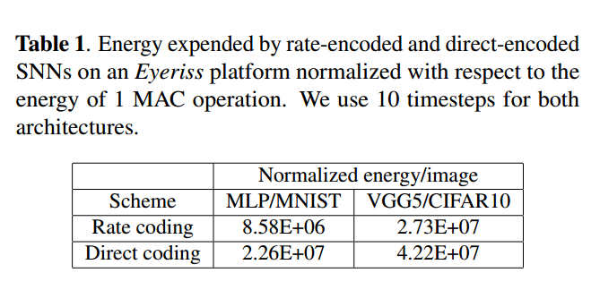

# 					Rate coding or direct coding

Recent Spiking Neural Networks (SNNs) works focus on an image classification task, therefore various coding techniques have been proposed to convert an image into temporal binary spikes. Among them, rate coding and direct coding are regarded as prospective candidates for building a practical SNN system as they show state-of-the-art performance on largescale datasets. Despite their usage, there is little attention to comparing these two coding schemes in a fair manner. In this paper, we conduct a comprehensive analysis of the two codings from three perspectives: accuracy, adversarial robustness, and energy-efficiency. First, we compare the performance of two coding techniques with various architectures and datasets.

Then, we measure the robustness of the coding techniques on two adversarial attack methods. Finally, we compare the energy-efficiency of two coding schemes on a digital hardware platform. Our results show that direct coding can achieve better accuracy especially for a small number of timesteps. In contrast, rate coding shows better robustness to adversarial attacks owing to the non-differentiable spike generation process.

Rate coding also yields higher energy-efficiency than direct coding which requires multi-bit precision for the first layer.

Our study explores the characteristics of two codings, which is an important design consideration for building SNNs1 .

近年来，尖峰神经网络(SNNs)的工作主要集中在图像分类任务上，因此提出了各种编码技术来将图像转换为时间二进制尖峰。其中，速率编码和直接编码被认为是构建实际SNN系统的潜在候选，因为它们在大规模数据集上表现出最先进的性能。尽管使用它们，但很少有人注意以公平的方式比较这两种编码方案。在本文中，我们从三个角度对这两种编码进行了全面的分析:准确性，对抗鲁棒性和能源效率。首先，我们比较了两种编码技术在不同架构和数据集下的性能。

然后，我们测量了编码技术对两种对抗性攻击方法的鲁棒性。最后，我们比较了两种编码方案在数字硬件平台上的能效。结果表明，==直接编码可以获得更好的精度，特别是对于少量的时间步长。相比之下，由于脉冲产生过程不可微，速率编码对对抗性攻击具有更好的鲁棒性。==

==速率编码也比直接编码产生更高的能源效率，因为直接编码需要第一层的多比特精度。==

我们的研究探讨了两种编码的特性，这是构建SNNs1的重要设计考虑因素。

### 1. INTRODUCTION

Our work provides several noteworthy observations for SNN design. Direct coding yields better accuracy than rate coding. The advantage of direct coding increases for deeper architecture and larger datasets. In terms of robustness, rate coding shows better robustness with respect to Fast Gradient Sign Method (FGSM) [15] and Projected Gradient Descent (PGD) [19] attacks due to the non-differentiable Poisson spike generator. On the other hand, since the direct coding layer is differentiable, malicious backward gradients can degrade the accuracy significantly. Furthermore, rate coding achieves higher energy efficiency from binary input spikes than direct coding where multi-bit operation is required.

我们的工作为SNN设计提供了几个值得注意的观察结果。==直接编码比速率编码产生更好的准确性。对于更深层次的架构和更大的数据集，直接编码的优势会增加。在鲁棒性方面，由于不可微泊松尖峰发生器，速率编码对快速梯度符号法(FGSM)[15]和投影梯度下降法(PGD)[19]攻击具有更好的鲁棒性。另一方面，由于直接编码层是可微的，恶意的向后梯度会显著降低精度。此外，在需要多比特操作的情况下，速率编码从二进制输入尖峰中获得比直接编码更高的能量效率。==

### 2. PRELIMINARIES: INPUT CODING SCHEMES

his coding scheme encodes the input by generating a spike train over T timesteps, where the total number of spikes is proportional to the magnitude of input values. The spikes are sampled from a Poisson distribution. Fig.

1(a) shows the rate coding mechanism. Direct coding [3] uses the floating-point inputs directly in the first layer. As shown in Fig. 1(b), we pass the input image (or RGB pixel values) through the first convolution layer which generates floating point outputs. Note, the float output values are repeated for T time-steps of SNN processing. These outputs are then processed through a layer of spiking neurons that generates binary spikes.

他的编码方案通过在T个时间步长上产生尖峰序列来编码输入，其中尖峰的总数与输入值的大小成正比。尖峰是从泊松分布中采样的。无花果。

1(a)为费率编码机制。直接编码[3]直接在第一层使用浮点输入。如图1(b)所示，我们将输入图像(或RGB像素值)通过生成浮点输出的第一个卷积层。注意，对于SNN处理的T个时间步，浮点输出值是重复的。然后，这些输出通过一层产生二进制尖峰的尖峰神经元进行处理。

### 3. RATE CODING VS. DIRECT CODING

3.4. Accuracy comparison

Fig. 2 shows the accuracy of rate-encoded SNN and directencoded SNN with respect to the number of timesteps. From the experimental results, we observe the following: (1) In general, direct coding brings higher accuracy than rate coding especially with small number of timesteps. (2) As the ratecoded SNN is trained with larger number of timesteps, the performance gap between the two coding decreases. (3) As the dataset and network architecture gets more complicated, the performance gap between the two coding increases. The reason for higher performance of direct-coded SNNs is a trainable input coding layer (Fig. 1(b)). The weights of the coding layer are trained for minimizing cross-entropy loss, providing optimal float amplitude

图2显示了速率编码SNN和方向编码SNN的准确度与时间步长的关系。从实验结果可以看出:(1)一般情况下，直接编码比率编码具有更高的精度，特别是在时间步长较少的情况下。(2)随着速率编码SNN训练的时间步数增加，两种编码之间的性能差距减小。(3)随着数据集和网络架构的日益复杂，两种编码之间的性能差距越来越大。直接编码snn性能更高的原因是可训练的输入编码层(图1(b))。对编码层的权值进行训练，使交叉熵损失最小化，从而提供最佳的浮动幅度

3.5. Robustness studies

Note, for generating adversarial examples for SNNs with rate coding, we use the method proposed by [16].

Interestingly, we find that rate-coded SNNs have higher adversarial robustness approximately up to 20% higher accuracy compared to direct-coded SNNs. This is because the Poisson generator function is non-differentiable, therefore the gradient has to be approximated, making the attack ineffective.

注意，对于带有速率编码的snn，我们使用[16]提出的方法生成对抗性示例。

有趣的是，我们发现与直接编码snn相比，速率编码snn具有更高的对抗性鲁棒性，准确率大约高出20%。这是因为泊松生成函数是不可微的，因此梯度必须是近似的，使得攻击无效。

[16] Saima Sharmin et al., “Inherent adversarial robustness of deep spiking neural networks: Effects of discrete input encoding and non-linear activations,” arXiv preprint arXiv:2003.10399, 2020.

3.6. Energy-efficiency of two coding schemes

### 4. CONCLUSION AND DISCUSSION

This study is motivated by the question: Which coding scheme is better for building accurate, robust, and energy-efficient SNN, rate coding or direct coding? Note that we focus on rate coding and direct coding because they enable SNNs to be trained on large-scale datasets with deep architectures. This question is timely as neuromorphic researchers are finding a way of scaling up the SNN models like their ANN counterparts. To explore this, we conduct a comprehensive analysis on accuracy, robustness, and energy-efficiency. Direct coding trains the weights of the coding layer, therefore the input image can be converted into the optimal spikes with float amplitude for minimizing cross-entropy loss. Consequently, direct coding achieves better accuracy than rate coding where the input spikes are generated based on pixel intensity. Although the learnable layer in direct coding improves performance, such layer is vulnerable to adversarial attack as it conveys malicious backward gradients to the input image. On the other hand, Poisson spike generator of the rate coding is non-differentiable and stochastic, resulting in less performance degradation in case of adversarial attack. We also find that rate-encoded SNNs achieve higher energy-efficiency on Eyeriss architecture than their direct-encoded counterparts. Overall, our extensive experiments provide a fundamental understanding of the two coding schemes.

这项研究的动机是:哪种编码方案更适合构建准确、鲁棒和节能的SNN，速率编码还是直接编码?注意，我们关注的是速率编码和直接编码，因为它们使snn能够在具有深度架构的大规模数据集上进行训练。这个问题是及时的，因为神经形态研究人员正在寻找一种方法来扩大SNN模型，就像他们的人工神经网络模型一样。为了探讨这一点，我们对准确性、稳健性和能源效率进行了全面的分析。直接编码训练了编码层的权值，因此可以将输入图像转换为具有浮动幅度的最优尖峰，以最小化交叉熵损失。因此，直接编码比基于像素强度生成输入尖峰的速率编码具有更好的准确性。虽然直接编码中的可学习层提高了性能，但由于它向输入图像传递了恶意的向后梯度，因此容易受到对抗性攻击。另一方面，速率编码的泊松尖峰发生器是不可微的和随机的，因此在对抗性攻击情况下性能下降较小。我们还发现速率编码的snn在Eyeriss架构上比直接编码的snn实现更高的能源效率。总的来说，我们广泛的实验提供了对两种编码方案的基本理解。