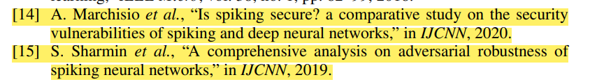
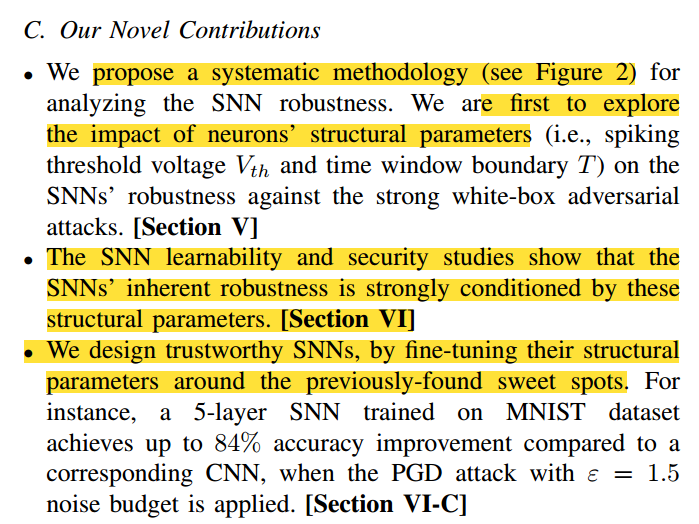
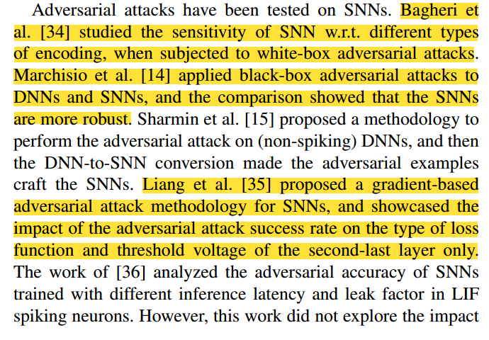
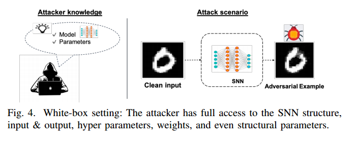
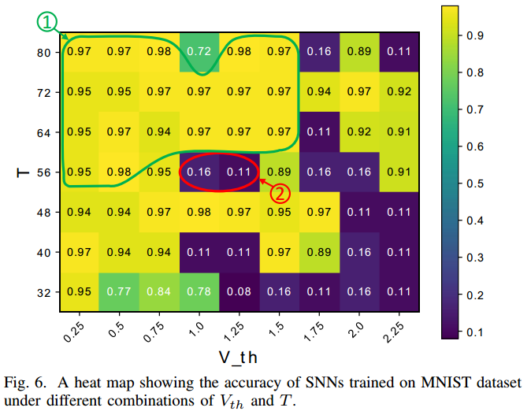
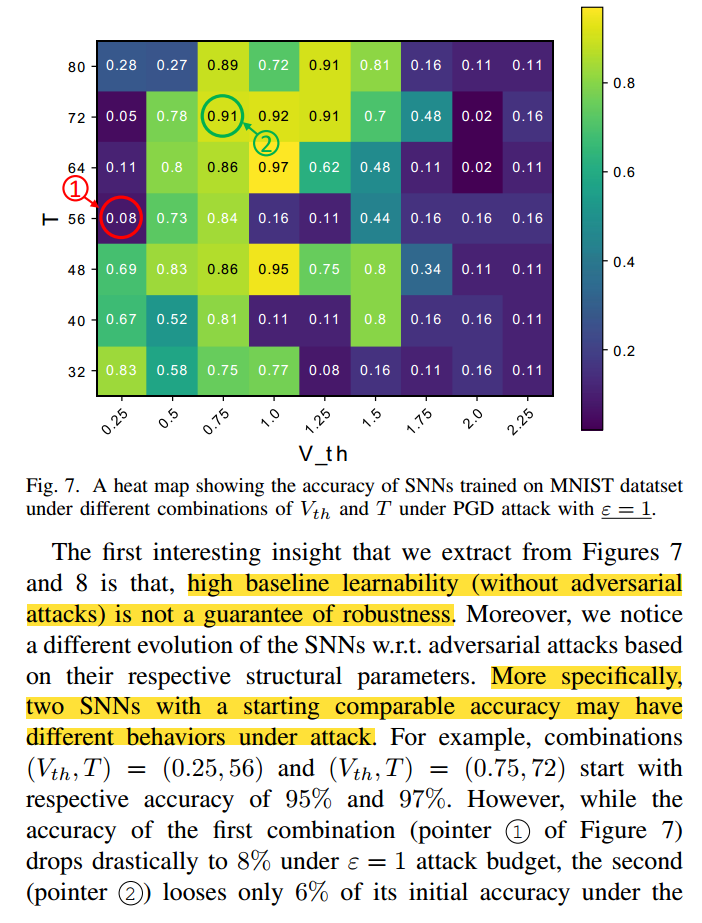

​												通过固有结构参数保护深度脉冲神经网络免受对抗性攻击

SNN的固有结构使层间数据具备天然的稀疏性[7]，。El-allami等人[7]研究了SNN对 不同神经元放电电压阈值和时间窗边界值条件下的 攻击鲁棒性。

### 摘要：

recent works claimed the inherent robustness of Spiking Neural Networks (SNNs) to these attacks, without considering the variability in their structural spiking parameters.

This paper explores the security enhancement of SNNs through internal structural parameters. Specifically, we investigate the SNNs robustness to adversarial attacks with different values of the neuron’s firing voltage thresholds and time window boundaries. We thoroughly study SNNs security under different adversarial attacks in the strong white-box setting, with different noise budgets and under variable spiking parameters. Our results show a significant impact of the structural parameters on the SNNs’ security, and promising sweet spots can be reached to design trustworthy SNNs with 85% higher robustness than a traditional non-spiking DL system.

最近的研究表明，在不考虑其结构尖峰参数的可变性的情况下，尖峰神经网络(snn)对这些攻击具有固有的鲁棒性。

本文探讨了通过内部结构参数增强snn的安全性。具体来说，我们研究了snn对不同神经元放电电压阈值和时间窗边界的对抗性攻击的鲁棒性。我们深入研究了在强白盒环境下，不同噪声预算和不同尖峰参数下snn在不同对抗性攻击下的安全性。我们的研究结果表明，结构参数对snn的安全性有显著影响，并且可以达到有希望的最佳点，以设计可靠的snn，其鲁棒性比传统的非尖峰深度学习系统高85%。

### I. INTRODUCTION

recent studies claimed inherent robustness of SNNs compared to traditional DNNs [14, 15].

最近的研究表明，与传统dnn相比，snn具有固有的鲁棒性[14,15]。

(Q1）尖峰结构参数（Q即阈值电压和时间窗电压和时间窗口）如何影响 SNN 在受到攻击时的行为？攻击下的行为？(Q2) SNN 是否天生就能抵御对抗性攻击？ 与结构参数无关？(Q3) 提供高精度的结构参数组合是否也能保证高鲁棒性？是否也能保证高鲁棒性？

### II. BACKGROUND

While other possible coding schemes can be based on the delay between consecutive spikes or the latency between the beginning of the stimulus to the first spike, the most commonly adopted mechanism is the rate encoding [9], where the activation intensity corresponds to the mean firing rate over a certain time window. Such a time window represents the observation period in which the SNN receives the same input. A

虽然其他可能的编码方案可以基于连续尖峰之间的延迟或刺激开始到第一个尖峰之间的延迟，但最常用的机制是速率编码[9]，其中激活强度对应于一定时间窗内的平均触发率。==该时间窗表示SNN接收相同输入的观测周期==。

A wider window gives more time for the spikes to propagate towards the output, but incurs in higher latency.

更宽的窗口为尖峰向输出传播提供了更多的时间，但会导致更高的延迟。

### IV. THREAT MODEL

The work of [36] analyzed the adversarial accuracy of SNNs trained with different inference latency and leak factor in LIF spiking neurons. However, this work did not explore the impact of membrane voltage threshold along with the time window.

Note, in contrast to the work in [36], we explore the impact of spiking parameters of the neurons on SNNs robustness to question the generalization of inherent robustness observation.

[36]的工作分析了在LIF尖峰神经元中使用不同推理延迟和泄漏因子训练的snn的对抗精度。然而，这项工作并没有探讨膜电压阈值随时间窗的影响。

注意，与[36]中的工作相反，我们探讨了神经元的峰值参数对snn鲁棒性的影响，以质疑固有鲁棒性观察的泛化。

### IV. THREAT MODEL

 In fact, we assume a powerful attacker who has the full knowledge of the victim classifier’s architecture and parameters (including the structural parameters Vth and T)

事实上，我们假设一个强大的攻击者完全了解受害者分类器的体系结构和参数(包括结构参数Vth和T)。

### V. PROPOSED METHODOLOGY

Our study aims at the exploration of SNNs’ robustness under different adversarial noise budgets, and this, for different (Vth; T) parameters combinations.

我们的研究旨在探索snn在不同对抗噪声预算下的鲁棒性，对于不同的(Vth;T)参数组合。

Note from pointer 1 of Figure 6 that the highest-accuracy combination tends to be towards the top-left corner, i.e., low Vth and high T

从图6的指针1可以看出，准确度最高的组合趋向于左上角，即低Vth和高T

鲁棒性测试：

### VII. CONCLUDING REMARKS

This paper investigated the security of SNNs from a new perspective., i.e., a systematic exploration of the impact of structural parameters of the bio-inspired neurons on the robustness of SNNs to adversarial attacks.

本文从一个新的角度研究了snn网络的安全性。，即系统探索生物神经元的结构参数对snn对对抗性攻击的鲁棒性的影响。

By tracking the robustness considering those parameters, we found a high impact of Vth and T on the robustness of SNNs.

通过跟踪考虑这些参数的鲁棒性，我们发现Vth和T对snn的鲁棒性有很大的影响。

(A1) Structural parameters (Vth; T) do have a significant impact on the robustness of SNNs, and a careful exploration needs to be carried out before deployment in safety-critical or security-sensitive applications.

(A2) Yes, SNNs have inherent robustness against adversarial attacks. However, this inherent robustness is highly conditioned by the choice of (Vth; T) combination.

(A3) No, a combination of (Vth; T) parameters that learns efficiently and gives high baseline accuracy is not a guarantee of robustness.

(A1)结构参数(Vth;T)确实对snn的鲁棒性有重大影响，在将其部署到安全关键型或安全敏感型应用程序之前，需要进行仔细的探索。

(A2)是的，snn对对抗性攻击具有固有的鲁棒性。然而，这种固有的鲁棒性在很大程度上取决于(Vth;T)的组合。

(A3)不，是(v)的组合;T)参数的有效学习并给出高基线精度并不能保证鲁棒性。

The observed possible negative impact of some parameters combinations even with high initial accuracy is a counterexample of the previously assumed unconditional inherent robustness. We believe that this is an interesting finding that can enable more comprehensively secure SNNs design. In future work, we will include deeper networks in our experiments, as we believe that the findings of this paper can be generalized to other SNNs and datasets. More complex behavior might be witnessed, but the very impact of structured parameters on SNNs robustness should be comparable.

==观察到的一些参数组合可能产生的负面影响，即使具有较高的初始精度，==是先前假设的无条件固有鲁棒性的反例。我们相信这是一个有趣的发现，可以实现更全面安全的snn设计。在未来的工作中，我们将在实验中加入更深层次的网络，因为我们相信本文的发现可以推广到其他snn和数据集。可能会看到更复杂的行为，但结构化参数对snn鲁棒性的影响应该是可比的。