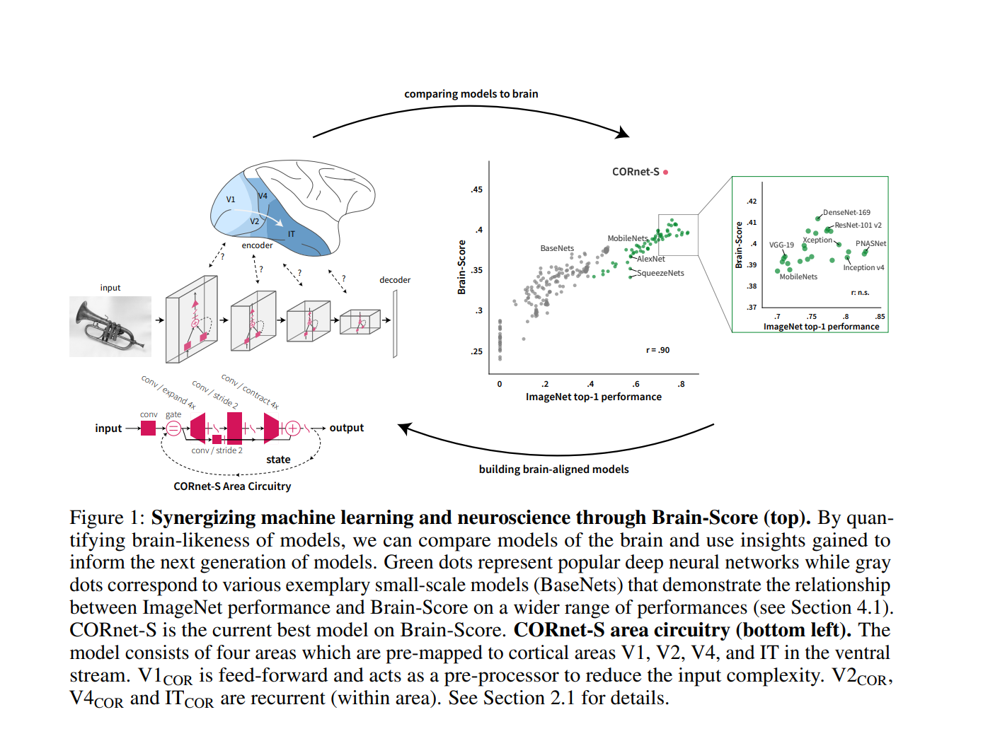

##### 							Brain-Like Object Recognition with High-Performing Shallow Recurrent ANNs

### 1 Introduction

We propose that aligning ANNs to neuroanatomy might lead to more compact, interpretable and, most importantly, functionally brain-like ANNs. To test this, we here demonstrate that a neuroanatomically more aligned ANN, CORnet-S, exhibits an improved match to measurements from the ventral stream while maintaining high performance on ImageNet.

我们提出，将人工神经网络与神经解剖学相结合可能会导致更紧凑、可解释，最重要的是，功能类似于大脑的人工神经网络。为了验证这一点，我们在这里展示了一个神经解剖学上更一致的人工神经网络，CORnet-S，在保持ImageNet高性能的同时，显示出与腹侧流测量的更好匹配。

CORnet-S commits to a shallow recurrent anatomical structure of the ventral visual stream,

CORnet-S致力于腹侧视觉流的浅层循环解剖结构

We identify that these results are primarily driven by recurrent connections, in line with our understanding of how the primate visual system processes visual information [43, 16]. In fact, comparing the high level ("IT") neural representations between recurrent steps in the model and time-varying primate IT recordings, we find that CORnet-S partly captures these neural response trajectories - the first model to do so on this neural benchmark.

我们认为这些结果主要是由循环连接驱动的，这与我们对灵长类视觉系统如何处理视觉信息的理解一致[43,16]。事实上，通过比较模型中循环步骤和时变灵长类动物IT记录之间的高级(“IT”)神经表征，我们发现CORnet-S部分捕获了这些神经反应轨迹——这是在该神经基准上第一个这样做的模型。

### 2 CORnet-S: Brain-driven model architecture

【20】Shibani Santurkar, Andrew Ilyas, Dimitris Tsipras, Logan Engstrom, Brandon Tran, and Aleksander Madry. Image synthesis with a single (robust) classifier. Advances in Neural Information Processing Systems, pages 1260–1271, 2019.

[20] Jonas Kubilius. Predict, then simplify. NeuroImage, 180:110 – 111, 2018.

We developed CORnet-S based on the following criteria (based on [20]):

我们基于以下标准(基于[20])开发了CORnet-S:

(1) Predictivity, (2) Compactness,(3) Recurrence:

#### 2.1 CORnet-S model specifics

CORnet-S (Fig. 1) aims to rival the best models on Brain-Score by transforming very deep feedforward architectures into a shallow recurrent model

CORnet-S(图1)旨在通过将非常深的前馈架构转换为浅循环模型，与Brain-Score上的最佳模型相媲美