#### 

### 1.3 融合神经计算的鲁棒深度卷积神经网络研究现状

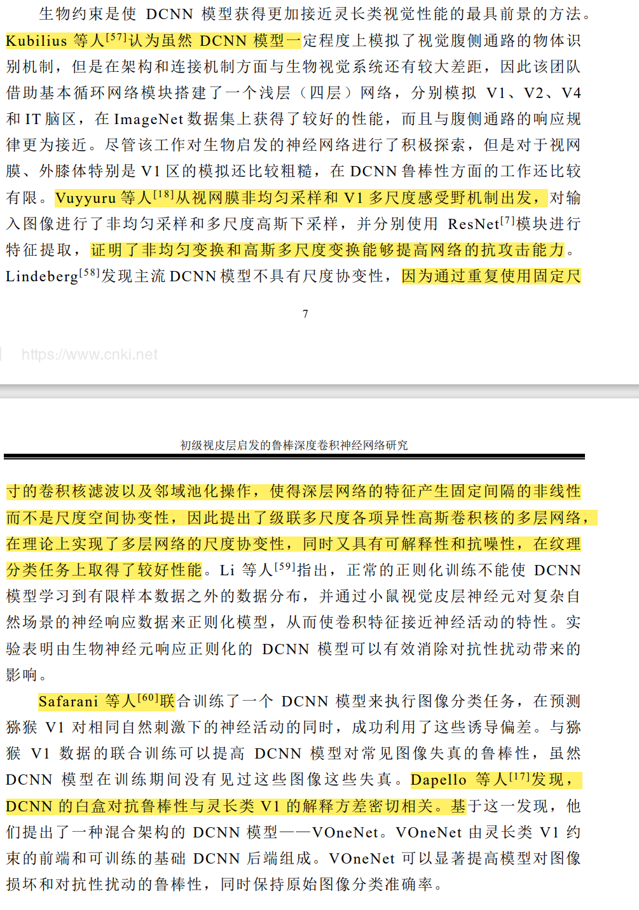

### 第2章 初级视皮层方位选择感受野模型

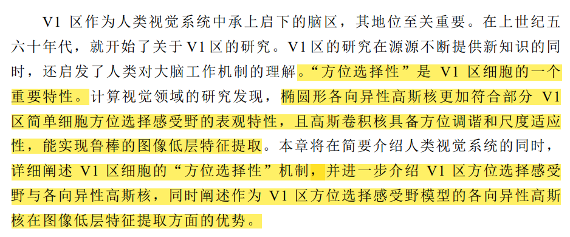

#### 1、视网膜细胞的了解和建模代码：

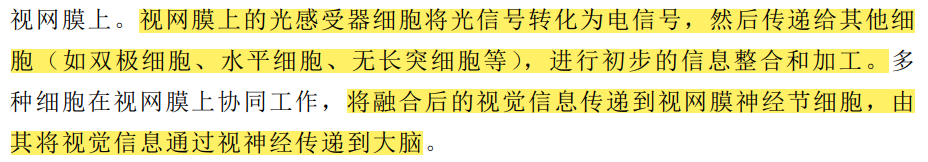

#### 2、感受野：

​	概念：

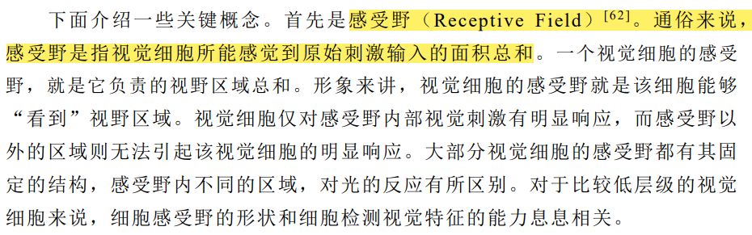

​	方位选择性：

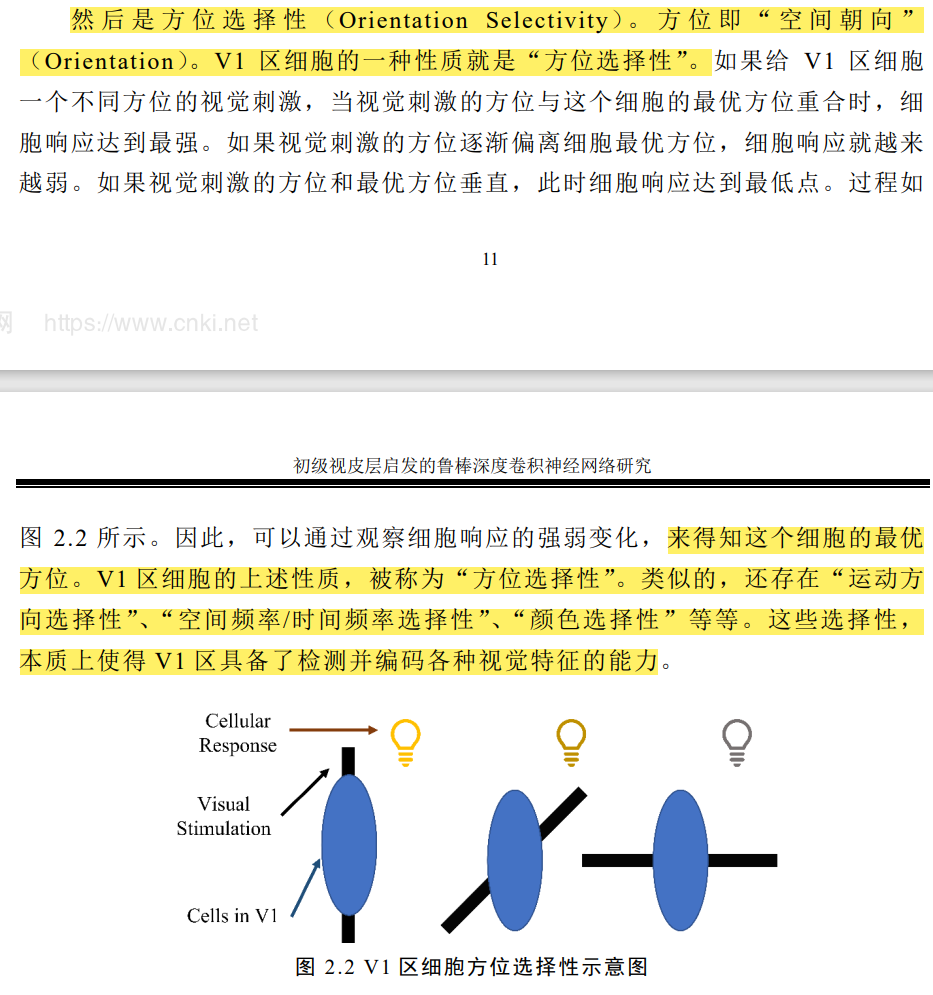

#### 2.2 初级视皮层的方位选择感受野

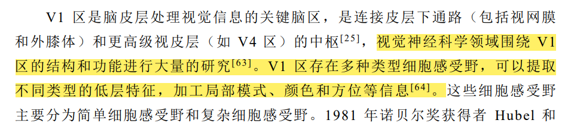

​	超柱模块：有待加强学习

​	方位调谐和尺度适应性：

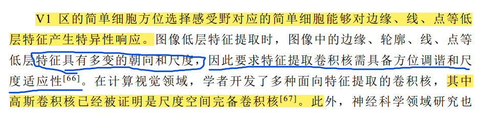

高斯卷积核的分类：

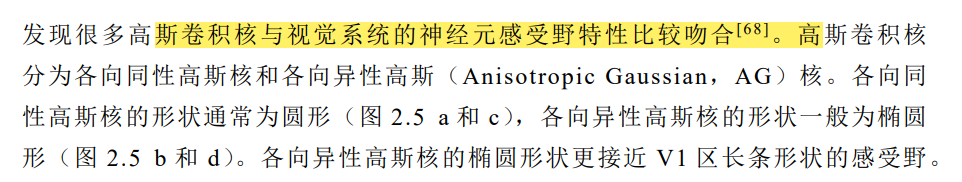

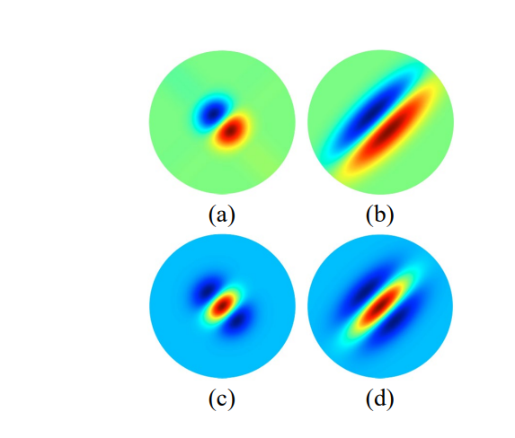

#### 总结：

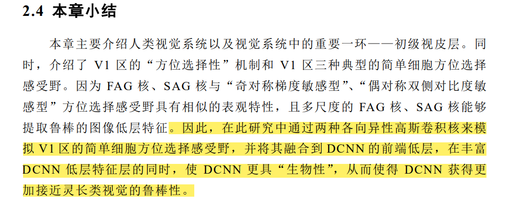

==两种各向异性高斯卷积核：==

### 第3章 初级视皮层启发的鲁棒深度卷积神经网络模型

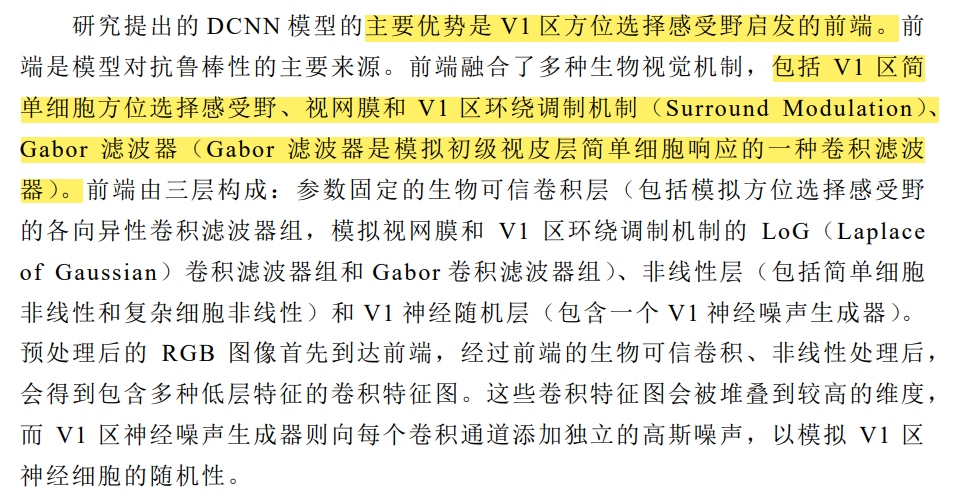

瓶颈层：

FAG、SAG 卷积核来源于高斯函数。

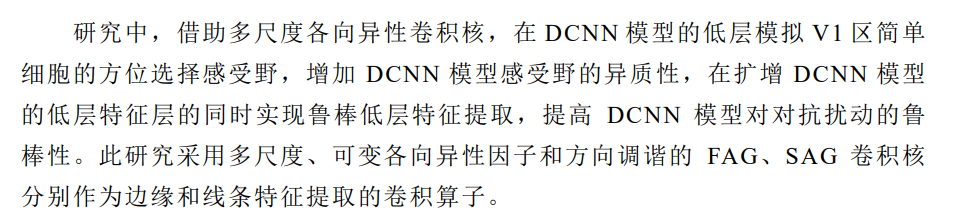

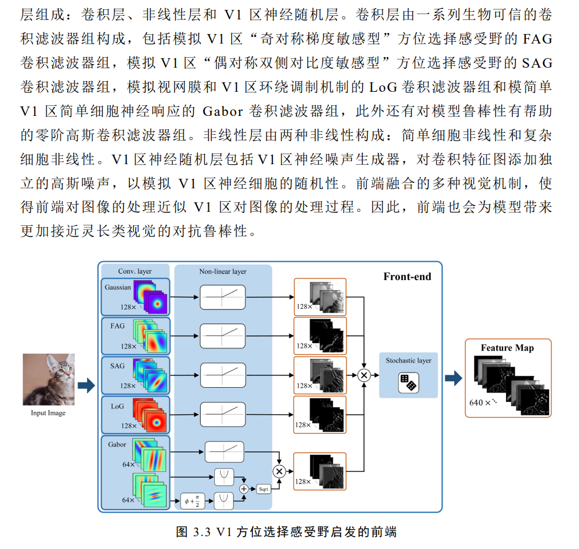

在视网膜和 V1 区中，神经元的响应不仅受到刺激物体的直接影响，还受到 周围区域的影响，这种周围区域的影响可以通过环绕调制机制来解释。

### 第5章 消融研究与基于模型可解释技术的模型分析

可解释工具：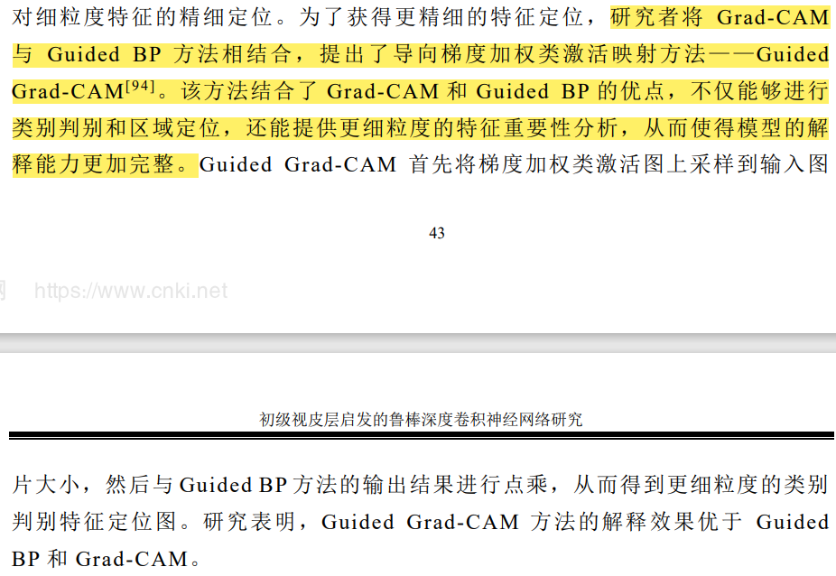

边缘和线条特征的概念：